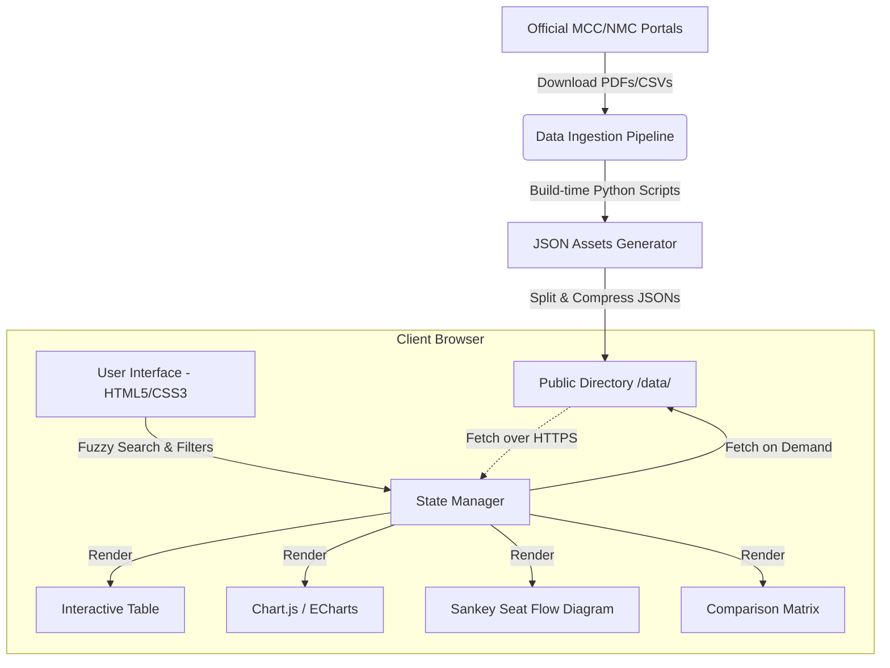

# NexDoc - NEET seat explorer - System Architecture Document

This document defines the system architecture, data flow, component layout, and technology stack for the **NexDoc - NEET seat explorer** web application. The application is designed to be a highly performant, zero-backend, search-oriented database explorer and analytics dashboard for medical seats in India across all levels: Undergraduate (UG), Postgraduate (PG), and Super Specialty (SS).

---

## 1. System Overview & Core Objectives

The goal is to build an interactive, data-rich explorer for Indian medical seat matrices that helps students research colleges, courses, quotas, and seat availability.

### Architecture Core Constraints & Principles

* **MBBS & Medical Pathways Primary Scope**: `NexDoc` is strictly designed for **MBBS** (Undergraduate) and further medical study pathways (**MD / MS / DNB** Postgraduate & **DM / MCh** Super Speciality).
* **Backend Pipeline vs UI View Layer Filtering**: All raw dataset files (including BDS, B.Sc Nursing, AYUSH) **MUST be fully ingested and processed** by backend python scripts to maintain 100% data integrity and prevent index corruption. Non-MBBS courses are **filtered out exclusively at the UI / presentation layer** (in `public/app.js` display logic).
* **Human-in-the-Loop Alias Verification**: Discovered raw institute strings from allotment PDFs must **NEVER** be auto-committed to `reference/alias-to-canonical.json` if there is any doubt or ambiguity. Any proposed alias mapping under uncertainty requires explicit user confirmation before committing.
* **GitHub Pages Ready (`github.io`)**: The entire application runs client-side. There are no server-side databases (such as PostgreSQL or MongoDB) or active server backends (such as Node.js/Express or Python/Django).
* **Zero Backend Costs**: By storing data in optimized JSON files, hosting is entirely free, scale-proof, and fast.
* **Premium Design & Micro-animations**: Modern visual system utilizing dark themes, glassmorphism, responsive CSS grid layouts, and seamless transitions.
* **Independent of Archive Data**: The system incorporates a build-time data ingestion pipeline that parses new official PDF seat matrices and CSVs directly from government web portals, keeping it separate from any stale repository archives.
* **No Category Divisions**: As reservation percentages are globally fixed by regulatory frameworks, the app focuses strictly on total/open/general seat matrices per college/course/quota.



---

## 2. Data Ingestion & Extraction Pipeline


### 2.1 Raw Ingestion Sources

/nmc-data

### 2.2 Build-time Parser (Python CLI)

A build script under `scripts/parse_seats.py` will process raw PDFs/CSVs using:

* `pdfplumber`: To extract table data from raw government seat matrix PDFs (which often contain multi-page tables with irregular cells).
* `pandas`: To clean headers, standardize names (e.g., standardizing "M.D. (GENERAL MEDICINE)" vs "MD General Medicine"), group rows, and calculate totals.
* **Standardization Mapper**: A dictionary-based mapping system to normalize college names, quota types, and branch/program codes.

### 2.3 Split-JSON Data Strategy (Payload Optimization)

Loading a single 10MB CSV/JSON for all UG, PG, and SS seats in the browser would create a poor user experience. To ensure the page loads in less than 500ms, the data is partitioned:

```
public/data/
├── manifest.json
├── ug/
│   ├── summary.json
│   └── states/
│       ├── karnataka.json
│       ├── maharashtra.json
│       └── ...
├── pg/
│   ├── summary.json
│   └── states/
│       ├── delhi.json
│       └── ...
└── ss/
    ├── summary.json
    └── states/
        ├── all_india.json
        └── ...
```

* **`manifest.json`**: Metadata about the seat matrix version, levels, last updated timestamp, and sizes of sub-packages.
* **`summary.json` (per level)**: Aggregate statistics for the main dashboard (total colleges, total seats, list of states, list of courses). Extremely lightweight (~15KB).
* **State Detail Files** (`states/{state_name}.json`): Contains granular row-level seats for that specific state. When a user selects "Karnataka", the browser lazy-loads only `karnataka.json` (~50KB to 150KB), minimizing memory and network overhead.

---

## 3. Quota Mapping & Seat Statistics Rules

To prevent data discrepancies and clarify how seats are distributed, the system classifies seats by both their physical location (Statewise) and their administrative admission route (All India Quota vs. State Quota).

### 3.1 Quota Classification Table

| Level                    | Quota Category                           | Source / Allocation                    | Counselling Body           | Scope & Domicile                   |
| :----------------------- | :--------------------------------------- | :------------------------------------- | :------------------------- | :--------------------------------- |
| **UG (MBBS/BDS)**  | **All India Quota (AIQ)**          | 15% of Govt. college seats             | MCC (Central)              | Open to all states (No Domicile)   |
| **UG (MBBS/BDS)**  | **Deemed Management / Paid**       | 100% of Deemed Univ. seats             | MCC (Central)              | Open to all states (No Domicile)   |
| **UG (MBBS/BDS)**  | **Deemed NRI**                     | 15% of Deemed Univ. seats              | MCC (Central)              | NRI Candidates (No Domicile)       |
| **UG (MBBS/BDS)**  | **Competent Authority Quota (CQ)** | 85% of Govt. + Private (Subsidized)    | Respective State Authority | Restricted to State Domiciles      |
| **UG (MBBS/BDS)**  | **Management Quota (MQ)**          | ~15%-35% of Private college seats      | Respective State Authority | Domicile / Open depending on State |
| **UG (MBBS/BDS)**  | **NRI / Minority Quota**           | ~15% of Private / Minority seats       | Respective State Authority | Category eligible / NRI candidates |
| **PG (MD/MS/Dip)** | **All India Quota (AIQ)**          | 50% of Govt. college seats             | MCC (Central)              | Open to all states (No Domicile)   |
| **PG (MD/MS/Dip)** | **Deemed Management / Paid**       | 100% of Deemed Univ. seats             | MCC (Central)              | Open to all states (No Domicile)   |
| **PG (MD/MS/Dip)** | **Competent Authority Quota (CQ)** | 50% of Govt. + Private (Subsidized)    | Respective State Authority | Restricted to State Domiciles      |
| **PG (MD/MS/Dip)** | **Management Quota (MQ)**          | ~15%-35% of Private college seats      | Respective State Authority | Domicile / Open depending on State |
| **PG (MD/MS/Dip)** | **NRI / Minority Quota**           | ~15% of Private / Minority seats       | Respective State Authority | Category eligible / NRI candidates |
| **SS (DM/MCh)**    | **All India Basis**                | 100% of Govt. + Deemed + Private seats | MCC (Central)              | Open to all states (No Domicile)*  |

> [!NOTE]
> *For NEET SS, 100% of seats in all government, private, and deemed colleges are counseled centrally by the MCC. There is no state-level quota, except for specific in-service candidate reservations (e.g. Tamil Nadu, Andhra Pradesh) which are also processed under central guidelines.

### 3.2 Statistical Aggregation Methods

The application performs statistics calculations across two distinct dimensions to prevent candidate confusion:

1. **Geographical/Physical Capacity (Statewise & All-India)**:
   * Represents the actual number of medical training seats physically located in a state's territory.
   * *Formula*: $\text{Total Physical Seats in State } X = \text{Govt Colleges (Total Capacity)} + \text{Private/Deemed Colleges (Total Capacity)}$.
   * Used in geographical charts, regional health capacity maps, and national capacity dashboards.
2. **Counselling Route Accessibility**:
   * Segregates seats by the portal where a student must register to apply for them.
   * *Formula*: $\text{Seats Accessible via MCC} = \text{AIQ (15\%/50\%)} + \text{100\% Central} + \text{Deemed (Management + NRI)} + \text{100\% SS}$.
   * *Formula*: $\text{Seats Accessible via State Portal } Y = \text{Competent Authority Quota (85\%/50\%)} + \text{State Management Quota} + \text{State NRI/Minority Quota}$.
   * Used in student-facing search queries to answer: *"Which portal do I use to apply for this seat?"*

### 3.3 Double-Counting Prevention Strategy

Since MCC data feeds (representing the AIQ, Central, and Deemed portion) and State DMER lists (representing the State Quota, Competent Authority, and State Private portion) cover the same physical colleges, merging datasets runs the risk of duplicating seat counts. The ingestion pipeline implements these safeguards:

* **Standardized College Registry**: Every college is assigned a normalized unique identifier (hash based on name, state, and NMC/DCI code).
* **Quota-based Partitioning**: Seat records in the output JSON files are tagged with a strict `counseling_route` property:
  ```json
  {
    "college_id": "KA_BMC_01",
    "college_name": "Bangalore Medical College",
    "state": "Karnataka",
    "course": "MBBS",
    "counseling_route": "MCC",
    "quota_type": "All India Quota",
    "seats": 37
  },
  {
    "college_id": "KA_BMC_01",
    "college_name": "Bangalore Medical College",
    "state": "Karnataka",
    "course": "MBBS",
    "counseling_route": "STATE",
    "quota_type": "Competent Authority Quota",
    "seats": 213
  }
  ```
* **Deduplicated Summation**: The client-side aggregation scripts calculate total college capacity by summing the seat array grouped by `college_id` instead of summing raw rows from different source documents.

### 3.4 Institutional Cross-Level (UG -> PG -> SS) Mapping

To provide institutional statistics and side-by-side comparison across all medical education levels (UG, PG, and SS), the ingestion pipeline maps independent datasets by establishing relationships between undergraduate colleges and their postgraduate/super-specialty equivalents:
* **Code-based Resolution**: Matches unique codes from the centralized college registry (e.g. `KA/001/P/3` -> `KA/001/P`), mapping colleges across undergraduate, postgraduate, and super-specialty details.
* **Tokenized Name Resolution**: Normalizes and tokenizes college names to resolve minor variations (e.g., "Adichunchanagiri Institute of Medical Sciences Bellur" vs "Adichunchanagiri Institute of Medical Sciences, Bellur"). It strips punctuation, ignores common filler words ("of", "and", "medical", "sciences", etc.), and performs token-set intersection calculations.
* **Granular Metrics Ingestion**: Merges PG and SS seat counts directly into the primary UG data structures (`pg_seats` and `ss_seats`), allowing instant rendering of institutional profiles without runtime file-joining overhead.

---

## 4. Client-Side Application Architecture

The client application is built as a single-page application (SPA) with a modular directory layout:

```
public/
├── index.html
├── app.css
├── app.js
├── components/
│   ├── SearchFilters.js
│   ├── AnalyticsPanel.js
│   ├── SankeyChart.js
│   └── ComparisonMatrix.js
└── data/
    └── ...
```

### 4.1 Reactive State Manager

The app will implement a simple reactive state pattern in `app.js` to coordinate search filters, selected cards, and rendering:

```javascript
const AppState = {
  // Data state
  activeLevel: 'ug', // 'ug' | 'pg' | 'ss'
  selectedState: null,
  activeFilters: {
    quota: 'all',
    instituteType: 'all',
    course: 'all',
    query: ''
  },
  loadedData: [],
  comparisonList: [], // Colleges currently in the compare drawer
  
  // Custom event-based subscription
  listeners: [],
  subscribe(fn) {
    this.listeners.push(fn);
  },
  setState(newState) {
    Object.assign(this, newState);
    this.listeners.forEach(fn => fn(this));
  }
};
```

### 4.2 Client-side Search Engine

For instant, database-like search:

* **Fuzzy Regex Search**: Custom multi-keyword regex matching in JavaScript:
  `const regex = new RegExp(AppState.activeFilters.query.split(' ').map(q => `(?=.*${q})`).join(''), 'i');`
* **Performance**: Index searches run directly on the loaded state-level JSON arrays. Filter operations on arrays of 5,000 items run in <10ms, eliminating the need for bulky external search indices.

---

## 5. UI/UX & Interactive Features

The design emphasizes high-density information display combined with sleek visuals (glassmorphic cards, custom typography, clean responsive grids).

### 5.1 UI Layout Structure

* **Header / Selector**: Level switcher tabs (UG, PG, SS) with counts, state selection dropdown, and global filter controls.
* **Dashboard Overview**: Micro-cards with key metrics (Total Colleges, Total Seats, Government vs. Private split) using smooth counters. Supports toggling statistics between "Geographical Capacity" (total physical seats in the state) and "Counseling Route availability" (AIQ vs. State Quota).
* **Search & Results Section**:
  * Left Column: Interactive search filters (Quota checkboxes, College type badges, Specialty lists).
  * Right Column: Tabbed view:
    * **Table View**: Row-by-row seat matrix with sorting.
    * **Analytics View**: Visual charts showing seat distribution.
    * **Sankey Flow**: Seat distribution map.
    * **Compare View**: Matrix comparison table.

### 5.2 Visualization Subsystems

1. **Interactive Charts (Chart.js / ECharts)**:
   * Bar charts showing seats by specialty (e.g., General Medicine vs. General Surgery).
   * Pie/Doughnut charts showing seat distribution by college ownership (Government, Deemed, Private).
2. **Sankey Seat Flow Diagrams**:
   * Visualizes the flow of seats: `Quota` $\rightarrow$ `State` $\rightarrow$ `College Type` $\rightarrow$ `Specialty` $\rightarrow$ `Seats`.
   * Implemented using **D3.js** or a lightweight, customized SVG-based renderer to avoid heavy library footprints.
3. **Side-by-Side Comparison Matrix**:
   * Users can check "Add to Compare" on up to 3 colleges.
   * Renders a sticky grid comparing:
     * College Name & Location
     * Available Seats (by Quota and Branch)
     * Ownership Type
     * Seat-mix ratios (e.g., Ratio of Clinical vs Non-Clinical seats)

---

## 6. Security, Validation & Deployment

### 6.1 Content Security & Verification

Because the app is static, standard security risks like SQL injection or SSRF are absent. However, data validity is critical:

* **Build-time Schema Validation**: Before generating output JSONs, the Python parser validates files against a Pydantic schema:
  * Seat counts must be integers > 0.
  * State names must match a predefined list.
  * Quotas must match normalized tokens.

### 6.2 Deployment Pipeline (GitHub Actions)

A CI/CD pipeline automated via GitHub Actions:

```yaml
name: Deploy NEET Seat Matrix Explorer
on:
  push:
    branches: [ main ]
    paths:
      - 'raw_matrices/**'  # Triggers when a new PDF matrix is added
      - 'scripts/**'
jobs:
  build-and-deploy:
    runs-on: ubuntu-latest
    steps:
      - name: Checkout Code
        uses: actions/checkout@v4
      - name: Set up Python
        uses: actions/setup-python@v5
        with:
          python-version: '3.10'
      - name: Install dependencies
        run: |
          pip install pdfplumber pandas pydantic
      - name: Parse Raw Matrices to JSON
        run: |
          python scripts/parse_seats.py --input raw_matrices/ --output public/data/
      - name: Deploy to GitHub Pages
        uses: JamesIves/github-pages-deploy-action@v4
        with:
          folder: public
          branch: gh-pages
```

---

## 7. Premium Styling Details (Aesthetic Token Guide)

To ensure the design looks sleek and modern, the application will use the following CSS theme system:

```css
:root {
  /* HSL Color System */
  --bg-primary: #0a0e17;      /* Deep midnight blue */
  --bg-secondary: #131a26;    /* Card background */
  --text-primary: #f1f5f9;    /* Off-white */
  --text-secondary: #94a3b8;  /* Muted blue-gray */
  --accent-blue: #3b82f6;     /* Neon blue accent */
  --accent-emerald: #10b981;  /* Emerald seats indicator */
  --border-glass: rgba(255, 255, 255, 0.08);
  --glass-shadow: rgba(0, 0, 0, 0.3);
  
  /* Typography */
  --font-family: 'Outfit', 'Inter', system-ui, sans-serif;
}

/* Glassmorphism utility */
.card-glass {
  background: rgba(19, 26, 38, 0.7);
  backdrop-filter: blur(12px);
  border: 1px solid var(--border-glass);
  box-shadow: 0 8px 32px 0 var(--glass-shadow);
  border-radius: 12px;
  transition: all 0.3s cubic-bezier(0.4, 0, 0.2, 1);
}

.card-glass:hover {
  transform: translateY(-2px);
  border-color: var(--accent-blue);
}
```

This styling provides a premium, responsive search and discovery experience that runs entirely within the user's browser, with minimal load times and zero server hosting overhead.
